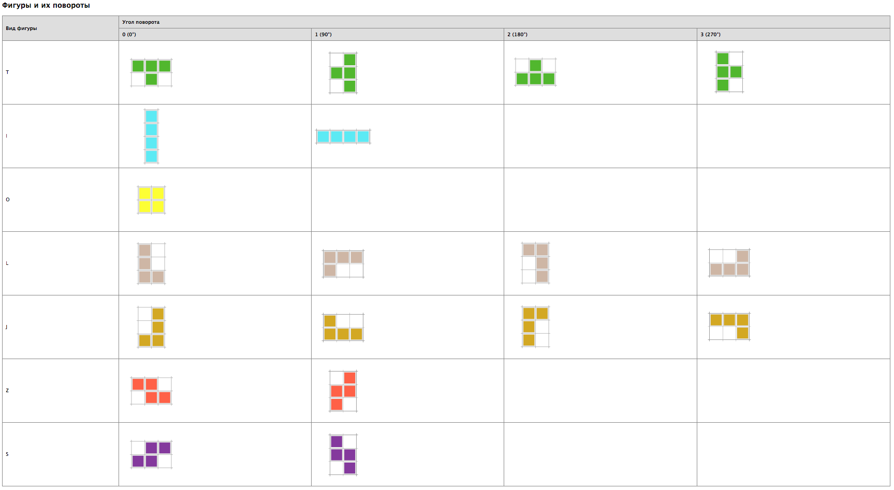

# IT duel 2016 at Anadea inc.

Epic win! :)

The challenge format - single creative problem, seven 4-max teams, 4 hours for solving,

The winner team: [Sergey Tokarenko](https://github.com/stokarenko), [Dmitriy Kiriyenko](https://github.com/dmitriy-kiriyenko), [Alexey Kudryashov](https://github.com/KudryashovAV).


## The problem
Goal: you need to collect foursquare N*N (where N since 4 to 50) from the given set of figures [tetromino](https://en.wikipedia.org/wiki/Tetromino).
The figures can be rotates.

Example - pair task-solution:


## API

Take the task:  
```console
  URL: "http://tetro.andy128k.net/api/puzzle"
>>>>>>> Update readme
```
HTTP method: `GET`

Required parameters:

* token - unique team identifier;
* size - foursquare(task) size;

Example:
```console
  curl --request GET "http://tetro.andy128k.net/api/puzzle?token=57492ce2-e312-4c80-b131-37be4031f30e&size=4"
```
Task example:

`{"id":123116,"size":4,"signature":"I1,J1,L1,Z1"}`, where

* id - task id;
* size - foursquare(task) size;
* signature - type and quantity of figures(in example we have a one piece type figures I, J, L, Z);

Send the reply:

```console
  URL: "http://tetro.andy128k.net/api/puzzle"
```

HTTP method: `POST`

Required parameters:

* token - unique token of your command;
* id - task id;
* solution - task solution;

Example:
```console
  curl --request POST --data "token=57492ce2-e312-4c80-b131-37be4031f30e&id=123116&solution=[[\"L\",1,0,0],[\"S\",0,0,1],[\"L\",1,3,0],[\"S\",0,1,2]]" http://tetro.andy128k.net/api/puzzle
```

In parameter `solution` as answer you must send matrix 4*M, where M - the total number of figures in the task

Each string has next format: `['figures type', angle of rotation, the position of the upper-left corner of the shape horizontally, the position of the upper-left corner of the shape vertical]`. Please note that the readout position begins with 0.  More species from the figures and their corners can be found in the image.



Example of a response to the solution: `{"id":123116,"solved":true,"submitted_at":"2015-12-12 12:12:12Z"}`, where

* id - task id;
* solved - solution result;
* submitted_at - time when solution taken.

## The solution
Clone it.
Bundle it.

Run it:
```console
  $ ./tetris net_solve {SIZE} [TIMEOUT]
```

Output sample, for 48 size:
```console
  [53.18s] {"id"=>407680, "size"=>48, "signature"=>"I38,J122,L48,O11,S130,T114,Z113"}
  [0.65s] Solved!
  [0.17s] {"puzzle_id"=>407680, "solved"=>true, "submitted_at"=>"2015-12-03T04:17:14.866Z"}
  ==========================================

  [34.41s] {"id"=>407681, "size"=>48, "signature"=>"I44,J116,L52,O13,S119,T104,Z128"}
  [0.57s] Solved!
  [0.57s] {"puzzle_id"=>407681, "solved"=>true, "submitted_at"=>"2015-12-03T04:17:50.420Z"}
  ==========================================

  [27.85s] {"id"=>407682, "size"=>48, "signature"=>"I41,J121,L41,O12,S123,T126,Z112"}
  [0.59s] Solved!
  [0.30s] {"puzzle_id"=>407682, "solved"=>true, "submitted_at"=>"2015-12-03T04:18:19.117Z"}
  ==========================================

  [4.13s] {"id"=>407683, "size"=>48, "signature"=>"I49,J108,L36,O10,S138,T104,Z131"}
  [0.73s] Solved!
  [0.28s] {"puzzle_id"=>407683, "solved"=>true, "submitted_at"=>"2015-12-03T04:18:24.257Z"}
  ==========================================
```

Want to see how it work? Choose the test case in `lib/tetris/test.rb`, run something like:
```console
  $ ./tetris test 12 -v
```
We do depth-first search. We try put the first figure, if it put - we take the next figure, otherwise - we rise above the stack and try other figures or new rotate of this figure.
When figures finished we come out ahead of recursion - it is the main trick at the level of the algorithm. For this we use a little-known Ruby feature `throw` / `catch` - it can be helpful.
For optimize we use bitmaps for figures and field.

## TODO
* Fix message on timeout, the problem is not solved in this case ))
* Fix verbose output
* Discover the remaining pathological cases

MIT License. Copyright (c) 2015 Sergey Tokarenko, Dmitriy Kiriyenko, Alexey Kudryashov.
