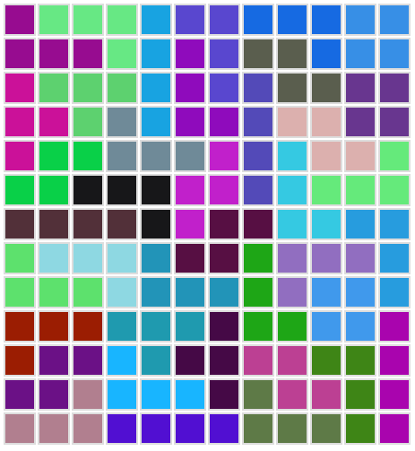
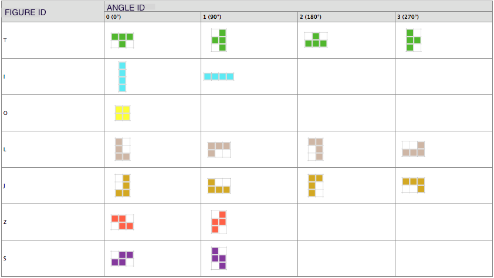
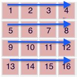
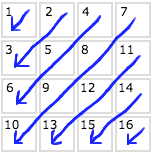
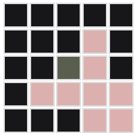
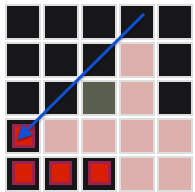
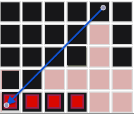
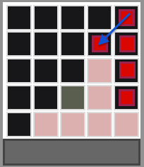
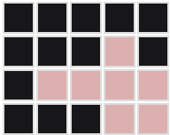
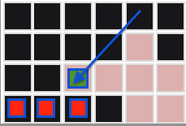

# IT duel 2016 at Anadea inc.

Epic win! :)

The challenge format - single creative problem, seven 4-max teams, 4 hours for solving.

The winner team:
* Sergey Tokarenko  - [LinkedIn](https://www.linkedin.com/in/stokarenko), [GitHub](https://github.com/stokarenko)
* Dmitriy Kiriyenko - [LinkedIn](https://ua.linkedin.com/in/kiriyenko), [GitHub](https://github.com/dmitriy-kiriyenko)
* Alexey Kudryashov - [LinkedIn](https://www.linkedin.com/in/alexey-kudryashov-27321056), [GitHub](https://github.com/KudryashovAV)


## The problem
The problem is about [the Tetris game](https://en.wikipedia.org/wiki/Tetris).
Need to compile the square N*N (4 <= N <= 50) from the given set of [tetromino figures](https://en.wikipedia.org/wiki/Tetromino).
The figures can be rotated.



In general, you are given:
```ruby
{
  size: N,
  signature: "#{FIGURE_1_ID}#{FIGURE_1_QUANTITY},...,#{FIGURE_M_ID}#{FIGURE_M_QUANTITY}"
}
```

The solution should look like:
```ruby
[
  [FIGURE_ID, ANGLE_ID, X_1, Y_1],
  ...,
  [FIGURE_ID, ANGLE_ID, X_I, Y_I]
]
```
X and Y are top-left corner coordinates of placed figure, both starting from 0.

Figure IDs and angle IDs should correspond to the definition:


## API

Take the task:  
```
  URL: "http://tetro.andy128k.net/api/puzzle"
  HTTP method: `GET`
```

Required parameters:
* token - unique team identifier;
* size - foursquare(task) size;

Example:
```console
  $ curl --request GET "http://tetro.andy128k.net/api/puzzle?token=57492ce2-e312-4c80-b131-37be4031f30e&size=4"

  >> {"id":123116,"size":4,"signature":"I1,J1,L1,Z1"}
```

Send the solution:
```
  URL: "http://tetro.andy128k.net/api/puzzle"
  HTTP method: `POST`
```

Required parameters:
* token - unique token of your command;
* id - task id;
* solution - task solution;

Example:
```console
  $ curl --request POST --data "token=57492ce2-e312-4c80-b131-37be4031f30e&id=123116&solution=[[\"L\",1,0,0],[\"S\",0,0,1],[\"L\",1,3,0],[\"S\",0,1,2]]" http://tetro.andy128k.net/api/puzzle

  >> {"id":123116,"solved":true,"submitted_at":"2015-12-12 12:12:12Z"}
```

## Winner ideas
There are just three ones:

1. Avoid the ado around `Where to place the figure?`.
   Instead, our target is to fill each cell of the board, one by one.

2. Avoid the ado around the figure structure and rotations via bit masks.
   Board is not the N\*N array as well, but an Integer compiled from N\*N bits.
   In additional, start not from empty N\*N board, but from (N+2)\*\(N+2) one, with a border -
   that helps us to avoid the ado around `Is the figure inside the board still?` and
   `Is the figure's bit mask applied without infliction with the board edges?`

3. Imagine the tree, where vertex is concrete board filling (starting from empty board),
   and edges represent the Figure & Angle pairs which can fill the next board's empty cell.
   Then, try to find the way from root `empty board` tree node to `fully filled board` node
   via [Depth-first search](https://en.wikipedia.org/wiki/Depth-first_search)

That's all - neither kind of connectivity checks nor programming ado  =)
So simple to implement within 4 hours, so effective to get a victory :)
The sources of that solution are marked by [v0.0.1](https://github.com/stokarenko/it-duel-2016/tree/v0.0.1) tag.

## Ultimate ideas
The `Ultimate` solution lives in [master](https://github.com/stokarenko/it-duel-2016) branch.
It is natural evolution of winner one, but extended by several key ideas. Such as...

### Balanced Figures Container !
[Check it out](lib/tetris/balanced_figures_container.rb)

When we thinking what to do with the next empty board cell -
try to place the figure types ordered by their remaining quantity, descending.

That helps us to reach the bottom of DFS stack
with a one-two figure by each type, almost always.

### Diagonal Cells Strategy !!
[Check it out](lib/tetris/diagonal_strategy/cell.rb)

In winner solution we iterated the board cells one after one, linearly:



That causes the long 2\*N pathologic cell lines at the bottom of DFS stack,
and turns DFS to infinity loop mode on large board sizes.

Lets walk through the board by diagonals:



`Diagonal Cells Strategy` & `Balanced Figures Container` synergy gives us
the small empty-cells triangle at the bottom of DFS stack,
with balanced remaining figures quantity.
This is brilliant behavior, since any task on any board size
aims to become the same small problem.

Now the remaining goal is to reach the bottom of stack as fast as possible. How to do that?..

### Connectivity !!!
The target is simple - don't allow to apply the figure, which isolates the empty cells.
How to do that?

Searching through the board for isolated empty cells each time when the figure has been applied?
So boring... Can we do better?

Easy to see that the total count of empty cells is equals to
`N*N - 4 * APPLIED_FIGURES_COUNT`. So we can take the right next empty cell,
and calculate the count of empty cells connected to the first one,
via [Breadth-first search](https://en.wikipedia.org/wiki/Breadth-first_search).
If the result doesn't correspond to the formula - some empty cells are isolated.

Now it's time to remember about `Diagonal Cells Strategy`. One more step -
check that connected empty cells count is just divisible by 4.
That give us almost (or even exactly) zero chance to get the pathological case.

Does BFS take O(N\*N) still? Then final step.
Consider that all diagonals  which are `previous` relatively to initial empty cell's one -
are always filled.
As well as all `next` diagonals starting from sixth one - are always empty.
Compile this knowledge, and reach the Holy Grail - the linear time.

[Check it out](lib/tetris/diagonal_strategy/connectivity.rb).

And, the last key idea is...

### Pathologies !!!!
Lets cure some pathologic situations.

The first of them look like:



There is no any figure which can be applied within.
Let's prevent this situation.

Again, don't be so boring...
Don't search this pattern through the whole board each time when some figure has been applied.

It's better to ask - when it appears?

Remember about `Diagonal Cells Strategy`.
Easy to see, that it appears right after the `J` figure with `1` angle is going to be applied:



Are these all the cases?..

No :) Let's consider also `I` figure with `1` angle:



The same related to `L : 2` and `I : 0` figures, when we are close to the board's bottom:



The second pathologic situation looks like:



The problem is that algorithm doesn't see that `L` figure can be applied here.
That's because it is trying to apply `L` like that:



[Check out](lib/tetris/diagonal_strategy/pathology.rb) the both fixes.

## Some cool programming tips & tricks

Third-party libraries:

* Use [Thor](https://github.com/erikhuda/thor) to build [the command-line interfaces](lib/tetris/cli.rb#L6)
* Use [httparty](https://github.com/jnunemaker/httparty) to build [the HTTP clients](lib/tetris/net_solver.rb#L12)

Ruby programming in general:

* Use [$LOAD_PATH](tetris#L9) & [autoload](lib/tetris.rb#L4-L17). Forget about `require`
* Use [throw](lib/tetris/solver.rb#L42) & [catch](lib/tetris/solver.rb#L26) rather than `raise` & `rescue` if the stack surface is a normal behavior, but not exception
* Aim to at least [linear memory usage](lib/tetris/solver.rb#L48-L54)
* Emulate the enumerable by yields ([one](lib/tetris/diagonal_strategy/pathology.rb#L8), [two](lib/tetris/diagonal_strategy/connectivity.rb#L52), [three](lib/tetris/balanced_figures_container.rb#L13)), rather than to feed the garbage collector by extra arrays. If you need the true enumerable for chaining - just add `return enum_for(:same_method_name, *args) unless block_given?` to the beginning of method
* [while(true)](lib/tetris/net_solver.rb#L29) is [MUCH faster](https://gist.github.com/stokarenko/a247f3f44997e8fbf31d) than `loop do` o_O
* Use [matrix.reverse.transpose](lib/tetris/figure_masks.rb#L68) to rotate the matrix by 90 clockwise, and `matrix.transpose.reverse` to rotate counterclockwise
* [Me](lib/tetris/figure_masks.rb#L45) - [mo](lib/tetris/figure_masks.rb#L64) - [ization](lib/tetris/board_with_border.rb#L9)!
* BalancedFiguresContainer should be ordered [by figure types](lib/tetris/balanced_figures_container.rb#L31), in additional to ordering by quantities. Otherwise the iteration through it will be corrupted.
* [BalancedFiguresContainer](lib/tetris/balanced_figures_container.rb) can be implemented much effectively by any kind of `OrderedArray`-like data structure, such as [Heap](https://en.wikipedia.org/wiki/Heap_(data_structure)). Hope that it's clear why we are idle here :)
* As for `Lazy` calculations in Ruby, look at some [frank benchmarks](https://gist.github.com/stokarenko/a78833d6587952f94e9b), think about..
* Remember that [Recursion](lib/tetris/solver.rb#L51) is anti-pattern in general case. Especially for Ruby, especially for now
* Remember that UnitTest is anti-pattern as well =)

Bit masks:

* Bitwise operators are [a bit SLOWER](https://gist.github.com/stokarenko/867d424b2b16038df784) than arithmetic analogs o_O
* In order to keep the board's lower coordinates at lower Integer bits, we need to [reverse](lib/tetris/mask_utils.rb#L7-L8) the figure mask
* Figure bit masks [should be compiled](lib/tetris/mask_utils.rb#L14) for each specific board size before the usage, since they are multiline
* Bitwise `AND` [helps us](lib/tetris/solver.rb#L66) to check the infliction of positioned figure with partially filled board
* Simple arithmetic addition [helps us](lib/tetris/solver.rb#L67) to apply the positioned figure. Consider that it works only if no inflictions there. In general case, bitwise `OR` does the same
* The `[]` method returns the specific bit on Integers

## The solution
Clone it.
Bundle it.

Run it:
```console
  $ ./tetris net_solve {SIZE} [TIMEOUT]
```

Output sample, for 50 size:
```console
  [23.53s] {"id"=>407833, "size"=>50, "signature"=>"I49,J127,L49,O13,S127,T126,Z134"}
  [0.07s] Solved!
  [0.32s] {"puzzle_id"=>407833, "solved"=>true, "submitted_at"=>"2015-12-06T16:48:07.162Z"}
  ==========================================

  [78.88s] {"id"=>407835, "size"=>50, "signature"=>"I50,J114,L65,O17,S155,T94,Z130"}
  [0.06s] Solved!
  [0.16s] {"puzzle_id"=>407835, "solved"=>true, "submitted_at"=>"2015-12-06T16:49:26.296Z"}
  ==========================================

  [18.79s] {"id"=>407836, "size"=>50, "signature"=>"I41,J101,L61,O16,S154,T136,Z116"}
  [0.06s] Solved!
  [0.25s] {"puzzle_id"=>407836, "solved"=>true, "submitted_at"=>"2015-12-06T16:49:45.374Z"}
  ==========================================

  [69.96s] {"id"=>407837, "size"=>50, "signature"=>"I52,J106,L47,O12,S156,T110,Z142"}
  [0.06s] Solved!
  [7.68s] {"puzzle_id"=>407837, "solved"=>true, "submitted_at"=>"2015-12-06T16:51:03.098Z"}
```

Do you want to see how does it work internally? There is a verbose mode of solving.
Choose [the test case](lib/tetris/test.rb), run something like:
```console
  $ ./tetris test 12 -v
```

## TODO
* Fix message on timeout, the problem is not solved in this case ))
* Move API URL and token to config file
* Cleanup connectivity
* Recursive to iterative (?)
* Describe some cool programming tricks
* One pathologic image is not perfect ((
* Tests (?)

## LICENSE
MIT License. Copyright (c) 2015 Sergey Tokarenko, Dmitriy Kiriyenko, Alexey Kudryashov.
